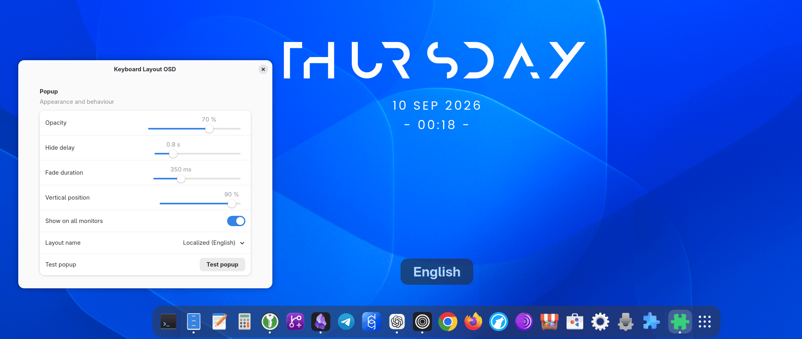

<p align="center">
  
</p>

# Keyboard Layout OSD

Keyboard Layout OSD shows a brief on-screen display when you switch keyboard
layouts or input languages in GNOME Shell.

<p align="center">
  
</p>

## Features

- Uses GNOME input-source names for any configured keyboard layout
- Short, localized, and full layout-name modes
- Configurable opacity, visibility time, fade duration, and vertical position
- Optional display on every monitor
- Built-in test button
- Native GNOME Shell and libadwaita interface



## Requirements

- GNOME Shell 50

## Install

Install Keyboard Layout OSD from
[GNOME Shell Extensions](https://extensions.gnome.org/extension/10919/keyboard-layout-osd/).

## NixOS

The repository provides a flake, so the extension can be installed directly
without waiting for it to reach Nixpkgs.

Add the input to your system flake:

```nix
inputs.keyboard-layout-osd = {
  url = "github:gruvery/keyboard-layout-osd";
  inputs.nixpkgs.follows = "nixpkgs";
};
```

You can test the package before adding it to a system configuration:

```bash
nix build github:gruvery/keyboard-layout-osd
```

Then add its NixOS module to your system definition:

```nix
nixosConfigurations.your-host = nixpkgs.lib.nixosSystem {
  modules = [
    ./configuration.nix
    inputs.keyboard-layout-osd.nixosModules.default
  ];
};
```

Rebuild the system and log out and back in so GNOME Shell discovers the new
system extension. Then enable **Keyboard Layout OSD** in the Extensions
application. It can also be enabled from a terminal:

```bash
gnome-extensions enable keyboard-layout-osd@gruvery.systems
```

Home Manager users can install the package directly:

```nix
{ inputs, pkgs, ... }:
{
  home.packages = [
    inputs.keyboard-layout-osd.packages.${pkgs.system}.default
  ];
}
```

## Install from source

Copy or clone the project to:

```text
~/.local/share/gnome-shell/extensions/keyboard-layout-osd@gruvery.systems/
```

Compile the settings schema and enable the extension:

```bash
cd ~/.local/share/gnome-shell/extensions/keyboard-layout-osd@gruvery.systems
glib-compile-schemas schemas
gnome-extensions enable keyboard-layout-osd@gruvery.systems
```

Open its settings from the Extensions application or with:

```bash
gnome-extensions prefs keyboard-layout-osd@gruvery.systems
```

## Development

After changing `extension.js` or the schema, reload the extension:

```bash
gnome-extensions disable keyboard-layout-osd@gruvery.systems
gnome-extensions enable keyboard-layout-osd@gruvery.systems
```

Close and reopen the preferences window after changing `prefs.js` or the
schema. On Wayland, logging out may be required if GNOME Shell keeps an older
extension instance or schema loaded.

## License

Keyboard Layout OSD is licensed under the
[GNU General Public License v3.0](LICENSE).

## Project

Developed by [Gruvery.Systems](https://github.com/gruvery). Source code and
issue tracking are available on
[GitHub](https://github.com/gruvery/keyboard-layout-osd).
